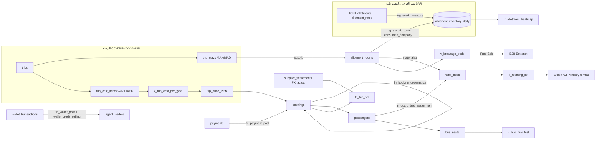
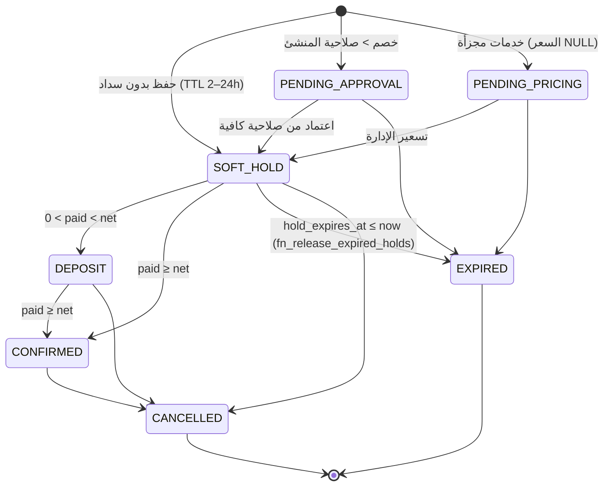

# Smart Umrah ERP — المرجع المعماري (Architecture Reference)

> Bed-Bank · Tri-Currency Costing · Sales Governance · Dual Visual Bed Maps · 49-Seat Bus · Operations · Trip P&L
>
> هذا المستند هو **المرجع الرئيسي** لأي مهندس أو وكيل ذكاء اصطناعي يبني فوق المنظومة. كل قاعدة عمل مذكورة هنا لها:
> (1) تنفيذ في محرك الواجهة `js/engine.js`، (2) حارس مقابل في قاعدة البيانات `db/schema.sql`، (3) اختبار آلي يثبتها.

---

## 1. ما تم تسليمه (Scope Delivered)

| المخرج | الملف | الحالة |
|---|---|---|
| نموذج PostgreSQL كامل (Enums, Constraints, FKs, Triggers, Views, Functions) | `db/schema.sql` | ✅ مطبق ومختبر على PostgreSQL 16 |
| اختبارات ثوابت قاعدة البيانات (63 فحصاً) | `db/tests.sql` | ✅ كلها تنجح |
| محرك قواعد العمل (بدون DOM، قابل للاختبار في Node) | `js/engine.js` | ✅ |
| اختبارات المحرك (20 اختباراً) | `tests/engine.test.js` | ✅ كلها تنجح |
| بيانات تجريبية واقعية (رحلة 10 أيام، 21 حجزاً، 44 مسافراً، 30 غرفة، 4 وكلاء) | `js/data.js` | ✅ التواريخ نسبية ليوم الفتح |
| تطبيق الواجهة (8 شاشات، Dark Emerald RTL) | `index.html`, `css/app.css`, `js/core.js`, `js/pages-*.js` | ✅ نموذج أولي يعمل بالكامل في المتصفح |

**حدود النموذج الأولي (بصراحة):** الواجهة تعمل على مستخدم واحد وتحفظ الحالة في `localStorage`. قاعدة البيانات مصممة كمصدر الحقيقة (Source of Truth) لبيئة الإنتاج، لكن **طبقة API التي تربط الاثنين لم تُبنَ بعد**. انظر §9.

---

## 2. السياقات المحدودة (Bounded Contexts) ↔ المحاور العشرة

| # | المحور | الجداول | دوال المحرك | الشاشة |
|---|---|---|---|---|
| 1 | مركز التكلفة متعدد العملات وFX | `cost_centers`, `trips`, `trip_cost_items`, `trip_price_list`, `supplier_settlements`, `v_trip_cost_per_type` | `computeCosting`, `priceList`, `fxVariance`, `toEGP` | البناء والتكلفة |
| 2 | المخصصات ورادار الإتاحات | `hotel_allotments`, `allotment_rates`, `allotment_inventory_daily`, `v_allotment_heatmap`, `v_breakage_beds` | `heatmap`, `cutoffRadar`, `breakage` | رادار الإتاحات |
| 3 | بوابة الوكلاء والمحافظ | `b2b_agents`, `agent_wallets`, `wallet_transactions`, `discount_authority`, `v_agent_statement` | `walletCheck`, `discountAuthority` | بوابة الوكلاء |
| 4 | محرك الحجز | `bookings`, `passengers`, `payments`, `installments`, `v_passport_alerts` | `priceBooking`, `applyPayment`, `clampTTL`, `releaseExpiredHolds`, `passportCheck` | محرك الحجز |
| 5 | التسكين المزدوج | `trip_stays`, `allotment_rooms`, `hotel_beds`, `rooming_locks` | `canPlace`, `visibleRoomsFor`, `assignBed`, `openSharedRoom`, `assignPrivateRoom`, `swapBeds`, `lockValidation` | التسكين المزدوج |
| 6 | باص 49/50 | `bus_trips`, `bus_seats`, `v_bus_manifest` | `BUS_LAYOUT`, `autoArrangeBus` | مقاعد الباص |
| 7 | العمليات والجوازات والبرنامج | `passport_vault`, `v_passport_current`, `itinerary_items`, `supervisors`, `trip_supervisors` | `PASSPORT_STAGES` | العمليات |
| 8 | أتمتة الواتساب | (قوالب في الواجهة؛ الإنتاج: جدول outbox — §9) | `waPhone`, `waLink` | العمليات ← الواتساب |
| 9 | التقارير الرسمية | `v_rooming_list`, `v_bus_manifest`, `v_agent_statement` | `roomingList` | العمليات ← التقارير |
| 10 | الإغلاق والأرباح | `fn_trip_pnl`, `field_expenses` | `tripPnL` | الإغلاق والأرباح |

---

## 3. تدفق البيانات (Data Flow)



---

## 4. آلات الحالة (State Machines)

### 4.1 دورة حياة الحجز

- الحالة **مشتقة** دائماً من (بوابة الاعتماد، بوابة التسعير، المال) داخل `fn_booking_governance` — لا يمكن لأي عميل كتابة `CONFIRMED` على حجز غير مسدد (`bk_confirmed_paid`).
- المال **لا يتجاوز** بوابات الاعتماد/التسعير (مختبر).
- `EXPIRED`/`CANCELLED` حالات نهائية (`TERMINAL_STATUS`).

### 4.2 لون السرير = دالة في حالة الحجز
| حالة الحجز | السرير | اللون |
|---|---|---|
| — | شاغر | 🟢 أخضر |
| SOFT_HOLD / PENDING_* | تسكين مبدئي | 🟡 أصفر منقط |
| DEPOSIT | مؤكد جزئياً | 🟠 برتقالي |
| CONFIRMED | مسكّن ومؤكد | 🔴 أحمر |
| غرفة مغلقة (سرير زائد) | مباع ضمن الغرفة | ⬛ مخطط |

### 4.3 سلسلة حيازة الجواز
`REP → SAFE → CONSULATE → SUPERVISOR → HANDED` — خطوة واحدة للأمام أو للخلف فقط (`fn_guard_passport_move`)، وكل حركة سجل تدقيق بتوقيت ومستخدم.

---

## 5. الخوارزميات الجوهرية

### 5.1 تكلفة الفرد (لكل فئة تسكين)
```
accom_SAR(type)  = (rate_MAK(type) × nights_MAK + rate_MAD(type) × nights_MAD) ÷ capacity(type)
breakage_SAR     = accom_SAR × breakage_pct (2.5%)
variable_EGP     = Σ VAR items (SAR × FX_ref)            ← طيران، تأشيرة، تأمين، نقل
fixed_share_EGP  = Σ FIXED items (SAR × FX_ref) ÷ planned_pax   ← باصات مزارات، مشرف، إكراميات، هدايا
cost(type)       = (accom_SAR + breakage_SAR) × FX_ref + variable_EGP + fixed_share_EGP
sell(type)       = ceil(cost × (1 + margin%) ÷ 250) × 250    → يُقفل في trip_price_list
child_no_bed     = Σ VAR × child_factor + fixed_share × child_fixed_factor
infant           = Σ VAR × infant_factor
```
عند قفل السعر (`prices_locked_at`) يصبح `trip_price_list` غير قابل للتعديل (`PRICE_LOCKED`)، وتعرض الواجهة **انحراف** السعر المقفل عن التكلفة الحية إذا تغيرت المدخلات بعد القفل.

### 5.2 فروق العملة
```
FX Variance (per settlement) = Amount_SAR × (FX_actual − FX_ref)        -- عمود مولّد في supplier_settlements
FX impact (trip)             = Σ settled_SAR × FX_actual + open_SAR × FX_market − total_SAR × FX_ref
Net profit                   = Operating profit (at FX_ref) − FX impact
```
الربح التشغيلي يقيس أداء المبيعات والتشغيل؛ أثر الصرف يظهر في سطر مستقل.

### 5.3 قفل الجنس (الحارس الأهم)
```
canPlace(room, pax):
  pax.type ≠ ADULT                → رفض (الأطفال/الرضع شارات بلا سرير)
  booking غير نشط / الكشف مقفل     → رفض
  room.private_booking_id         → قبول فقط لنفس الحجز (يتخطى فحص الجنس)
  booking.mode = PRIVATE_ROOM     → رفض في غرف التفريد
  room.gender_lock IS NULL        → رفض (افتح الغرفة أولاً)
  room.gender_lock ≠ pax.gender   → رفض GENDER_MIX_FORBIDDEN
  وجود ساكن من الجنس الآخر        → رفض (دفاع إضافي ضد بيانات تالفة)
```
- **الواجهة** لا تعرض غرف الجنس الآخر أصلاً (`visibleRoomsFor`) — منع الخطأ البشري قبل وقوعه.
- **قاعدة البيانات** تقفل صف الغرفة `FOR UPDATE` داخل الحارس، فجلستان متزامنتان لا يمكنهما تسكين رجل وامرأة في غرفة واحدة.
- التبديل `fn_swap_beds` يعيد فحص الطرفين ويفشل ذرياً دون تحريك أي سرير.
- قيد `one_bed_per_city` (مؤجل Deferrable) يضمن سريراً واحداً للمسافر في كل مدينة ويسمح بالتبديل داخل معاملة واحدة.

### 5.4 الامتصاص والفائض (Absorption & Breakage Release)
- إدراج غرفة في `allotment_rooms` يزيد `consumed_company` لليالي الإقامة فقط، والقيد `inventory_not_oversold` يمنع تجاوز العقد.
- الغرف غير المفتوحة تبقى مخفية في "مخصص الرحلة"؛ الأسرّة الشاغرة داخل غرف التفريد المفتوحة تظهر في `v_breakage_beds` وتُنشر تلقائياً كإتاحات حرة للوكلاء.

### 5.5 التعليق المؤقت (Soft-Hold TTL)
- `bk_hold_has_ttl` + `bk_ttl_window` + `TTL_WINDOW`: أي حالة معلقة يجب أن تحمل مهلة بين ساعتين و24 ساعة.
- `fn_release_expired_holds()` تنهي الحجوزات وتحرر الأسرّة ومقاعد الباص والغرف المغلقة في معاملة واحدة. الإنتاج: `pg_cron` كل دقيقة. الواجهة: مؤقت كل ثانية مع عداد تنازلي حي.

### 5.6 ترتيب الباص التلقائي
العائلات متجاورة ← العائلات التي بها كبار سن (≥60) في المقدمة ← الأفراد كبار السن ← باقي العائلات ← الأفراد مجمعين حسب الجنس (يبدأ كل تجمع على زوج مقاعد جديد فلا يتجاور غريبان من جنسين). الرضع بلا مقعد (`INFANT_NO_SEAT`).

---

## 6. مصفوفة الثوابت (Invariant Matrix)

| القاعدة | المحرك | قاعدة البيانات | الاختبار |
|---|---|---|---|
| منع الاختلاط في التفريد | `canPlace` / `swapBeds` | `fn_guard_bed_assignment`, `fn_guard_room_lock` | engine ✔ · sql ✔ |
| الغرفة المغلقة لحجز واحد فقط | `canPlace` | `PRIVATE_ROOM`, `private_consistency` | ✔ · ✔ |
| الطفل/الرضيع بلا سرير | `PAX_TYPES.takesBed` | `NO_BED_PAX` | ✔ · ✔ |
| سرير واحد لكل مسافر في كل مدينة | `assignBed` | `one_bed_per_city` | — · ✔ |
| عدم تجاوز المخصص | `heatmap.free` | `inventory_not_oversold` | — · ✔ |
| صلاحيات الخصم الهرمية | `priceBooking` | `fn_booking_governance`, `APPROVER_AUTHORITY` | ✔ · ✔ |
| الخدمات المجزأة بانتظار التسعير | `priceBooking` | `bk_price_known` + governance | ✔ · ✔ |
| مهلة التعليق 2–24 ساعة وتحرير آلي | `clampTTL`, `releaseExpiredHolds` | `TTL_WINDOW`, `bk_ttl_window`, `fn_release_expired_holds` | ✔ · ✔ |
| السقف الائتماني وقفل المتأخرات | `walletCheck` | `wallet_credit_ceiling`, `CREDIT_LOCK` | ✔ · ✔ |
| صلاحية الجواز ≥ 6 أشهر بعد العودة | `passportCheck` | `v_passport_alerts` | ✔ · ✔ |
| السعر الرسمي المقفل | `priceList` | `PRICE_LOCKED` | ✔ · ✔ |
| قفل كشف التسكين النهائي | `canPlace`, `lockValidation` | `ROOMING_LOCKED` | — · ✔ |
| سلسلة حيازة الجواز | خطوة ±1 في الواجهة | `CUSTODY_CHAIN` | — · ✔ |
| فروق العملة | `fxVariance`, `tripPnL` | `fx_variance_egp` (عمود مولد), `fn_trip_pnl` | ✔ · ✔ |
| رقم غرفة فعلي فريد | فحص التكرار في الواجهة | `allotment_rooms_physical_uq` | — · ✔ |

---

## 7. شاشات الواجهة

1. **البناء والتكلفة وFX** — معاملات الرحلة، أسعار المخصصات، بنود التوريد (متغير/ثابت، SAR/EGP، معاملات الطفل والرضيع)، جدول تكلفة الفرد لكل فئة، قفل السعر الرسمي (مدير فقط)، مستخلصات الموردين بسعر الصرف الفعلي.
2. **رادار الإتاحات** — مصفوفة يومية (شركة 🔵 / وكلاء 🟣 / معلق 🟡 / حر 🟢)، رادار Cut-off بإنذار 7 أيام، تسعير مواسم لفترة محددة، حجز سريع من محفظة الوكيل، مشاركة واتساب/إيميل، أسرّة التفريد الحرة.
3. **محرك الحجز** — 3 قنوات × 4 مسارات، مسافرون متعددون (بالغ/طفل/رضيع) بكل بيانات الجواز، ملخص حي بالحوكمة، دفتر حجوزات بعداد تنازلي، سندات قبض، اعتماد خصم، تسعير إداري، زر ⏩ لتجربة التحرير الآلي.
4. **بوابة الوكلاء** — المحافظ والسقوف والأقفال، العمولات التشجيعية (خصم للعميل / رصيد للوكيل يُصرف بعد السداد الكامل)، مصفوفة الصلاحيات، معاينة Extranet برقم سري.
5. **التسكين المزدوج** — مكة/المدينة، وضع المبيعات ووضع Swap، حجب الجنس الآخر، فتح غرفة تفريد، إغلاق غرفة لعائلة، شارات الأطفال، تحويل الأكواد لأرقام فعلية بالجملة، قفل نهائي بفحص ما قبل القفل.
6. **الباص** — 49 مقعداً (11 صفاً 2+2 + كنبة خلفية 5)، سحب وإفلات، تبديل بالنقر، ترتيب تلقائي.
7. **العمليات** — خزنة الجوازات، البرنامج اليومي والمشرف، 5 قوالب واتساب، كشف التسكين السعودي (Excel/CSV/PDF)، مانيفست الباص، فوتشر المعتمر، كشوف حساب الوكلاء.
8. **الإغلاق والأرباح** — مؤشرات، شلال أرباح، دفتر FX مستقل، نثريات المشرفين.

**بنية الكود:** `engine.js` (قواعد نقية) ← `data.js` (بيانات) ← `core.js` (المخزن، الحفظ، تفويض الأحداث عبر `data-act`/`data-bind`/`data-ui`/`data-live`، النوافذ، الطباعة، التصدير، مؤقت TTL) ← `pages-*.js` (كل صفحة دالة تُرجع HTML وتسجل أفعالها في `App.actions`).

---

## 8. التشغيل والاختبار

```bash
# الواجهة: افتح الملف مباشرة أو عبر الخادم الموجود
open umrah-erp/index.html            # أو: npm start ثم http://localhost:3000/umrah/

# اختبارات المحرك (20)
node --test umrah-erp/tests/*.test.js

# قاعدة البيانات (PostgreSQL ≥ 14)
createdb umrah
psql -d umrah -v ON_ERROR_STOP=1 -f umrah-erp/db/schema.sql
psql -d umrah -v ON_ERROR_STOP=1 -f umrah-erp/db/tests.sql   # 63 فحصاً، داخل معاملة ثم ROLLBACK
```

---

## 9. خارطة الطريق للإنتاج (للفرق والوكلاء البرمجيين)

| الأولوية | العمل | ملاحظات التصميم |
|---|---|---|
| P0 | طبقة API (Node/NestJS أو Fastify) فوق `db/schema.sql` | كل endpoint = معاملة واحدة؛ ترجمة أكواد الأخطاء (`GENDER_MIX_FORBIDDEN`، `CREDIT_LOCK`…) إلى رسائل عربية؛ المحرك الحالي يبقى للتحقق المسبق في الواجهة فقط |
| P0 | مصادقة وRBAC | ربط `staff.role` بالجلسات؛ الوكيل بـ `pin_hash` (argon2) + 2FA؛ Row-Level Security لعزل بيانات كل وكيل |
| P0 | `pg_cron` لـ `fn_release_expired_holds` + تحديث `overdue_since` من أعمار الذمم | |
| P1 | Outbox للواتساب: جدول `notifications_outbox` + عامل يرسل عبر WhatsApp Cloud API ويستقبل Webhooks التسليم | القوالب الخمسة جاهزة في `pages-ops.js` (`WA`) |
| P1 | OCR للجوازات: قراءة MRZ (TD3) لملء الاسم الإنجليزي والرقم والانتهاء آلياً | `passengers.name_en` مقيد بصيغة MRZ |
| P1 | تحديث حي متعدد المستخدمين (LISTEN/NOTIFY أو WebSocket) لخريطة الأسرّة والرادار | الأقفال على مستوى الصف تحمي التزامن حالياً |
| P2 | تكامل نسك / بوابة العمرة المصرية لرقم الحدود والتأشيرات | `border_no` جاهز |
| P2 | تعدد الشركات (Multi-tenant) بعمود `tenant_id` + RLS | |
| P2 | قيود محاسبية مزدوجة (GL) لكل حدث: سند قبض، مستخلص، عمولة، فرق صرف | مركز التكلفة جاهز كبُعد تحليلي |

**قواعد للبناء التراكمي:**
1. أي قاعدة عمل جديدة تُضاف في `engine.js` **و** حارس في `schema.sql` **و** اختبار في الملفين.
2. لا تكتب الحالة `status` يدوياً — عدّل المدخلات (مال/اعتماد/تسعير) ودع `fn_booking_governance` يشتقها.
3. لا تحذف غرفة مسكونة ولا تعيد غرفة مسكونة للمخصص — الحارس سيرفض.
4. التواريخ في البيانات التجريبية نسبية؛ الاختبارات تثبت `NOW` لتكون حتمية.
